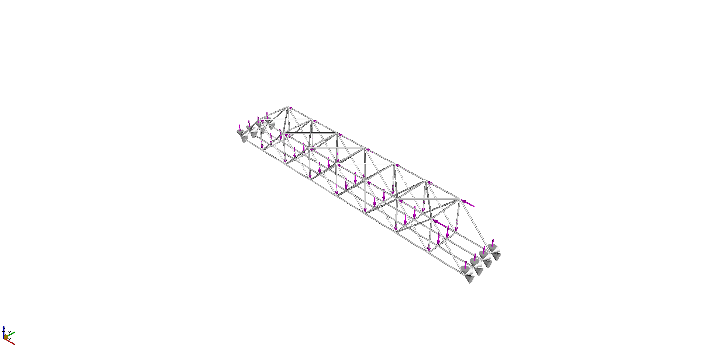
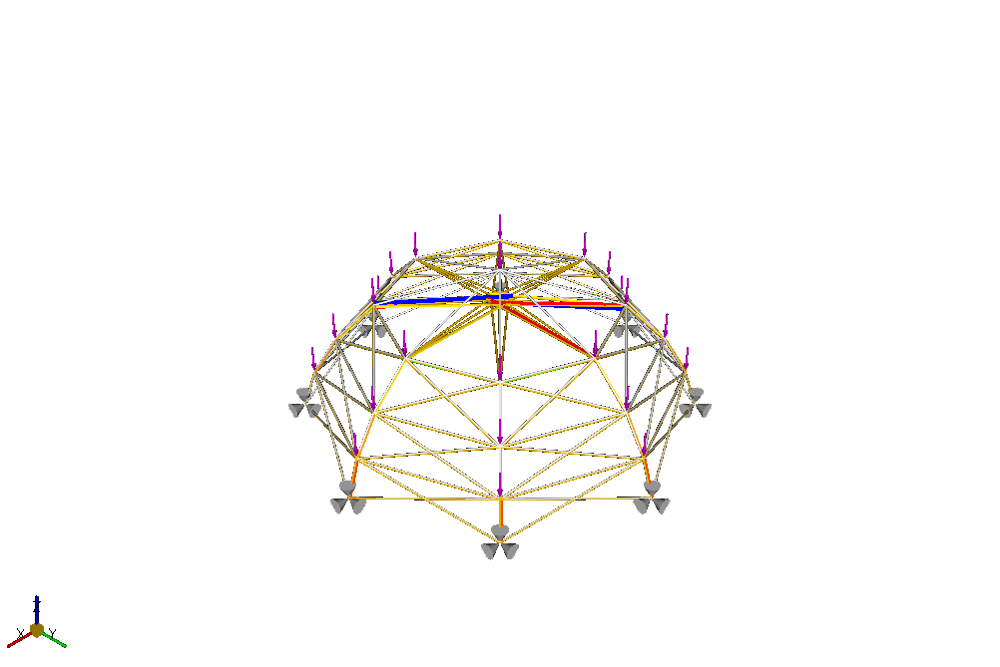
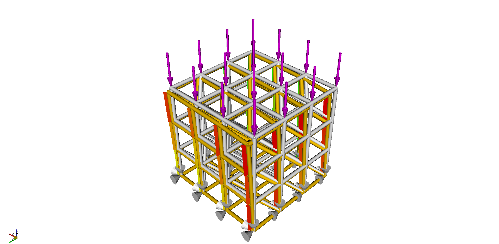

# Object-Oriented Structural FEM Solver in Java

An academic finite-element program for the analysis and visualization of spatial truss structures, developed during the M.Sc. Computational Engineering program at Ruhr University Bochum.

## Overview

The program implements an object-oriented workflow for structural finite-element analysis, including:

- representation of nodes, elements, forces and constraints
- global stiffness-matrix assembly
- application of boundary conditions
- solution of the structural system
- displacement and structural-response evaluation
- visualization of three-dimensional truss structures
- verification using benchmark and example models

## Project Structure

- `src/fem/` – core finite-element and solver classes
- `src/model/` – example structural models
- `src/test/` – tests and demonstration cases
- `images/` – selected visualizations of example structures

## Example Models

The repository includes several example structures:

- dome structure
- lattice cube
- tetrahedral structure
- tower structure
- truss bridge

## Technologies

- Java
- Object-oriented programming
- Finite Element Method
- Structural mechanics
- Numerical linear algebra

## Example Results

### Truss Bridge

### Dome Structure

### Lattice Cube

## Running the Project

1. Clone or download the repository.
2. Open the project in a Java IDE.
3. Compile the source files inside `src/`.
4. Run one of the example or test classes.

Exact execution instructions depend on the Java version and project configuration.

## Scope and Limitations

This is an academic finite-element solver developed for learning, implementation and benchmark verification. It is not intended as a replacement for commercial structural-analysis software.
